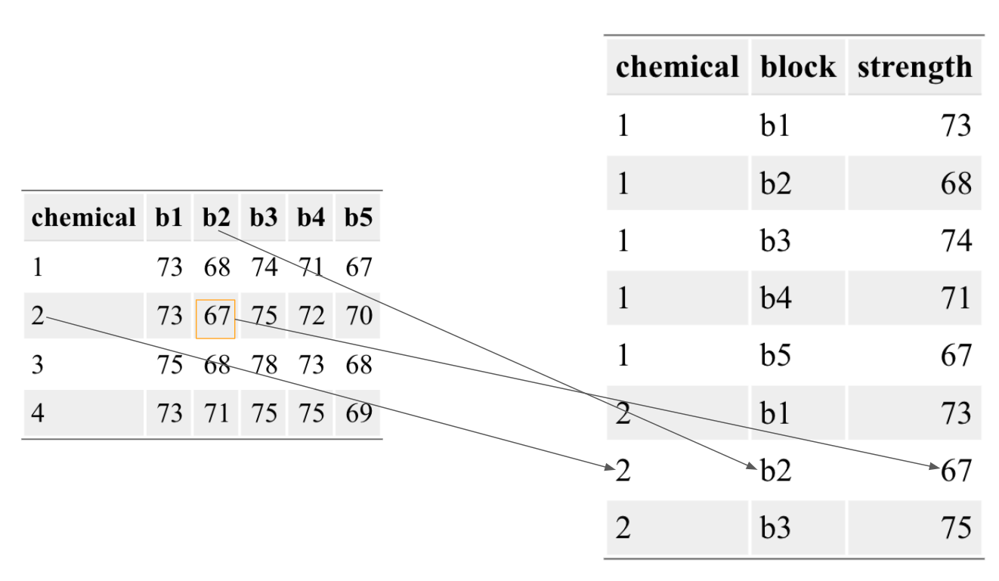

---

title: "disc_week_7"
author: "Hanying Jiang"
output:
  xaringan::moon_reader:
    css: ["default", "css/xaringan-themer.css", "cols.css"]
    lib_dir: libs
    nature:
      beforeInit: "cols_macro.js"
      highlightStyle: github
      highlightLines: true
      countIncrementalSlides: false
      ratio: "16:9"
    seal: false  
---

```{r setup, include=FALSE}
knitr::opts_chunk$set(echo = TRUE)
```
```{r, echo = FALSE}
library(knitr)
```

# Week 7
## Today's plan

 - Solve 4.7 (1) and (2) together.
 - Solve left questions in 4.7 by groups (10 - 15 min).
 - I'll go through the solution.
 - Solve question 4.12 by groups (10 - 15 min).
 - I'll go through the solution.
 - A quick review.

## Main topics

RCBD

---

## Problem 4.7
A chemist wishes to test the effect of four chemical agents on the strength of a particular type of cloth.  Because there might be variability from one bolt to another, the chemist decides to use a randomized block design, with the bolts of cloth considered as blocks.  She selects five bolts and applies all four chemicals in random order to each bolt.  The resulting tensile strengths follow.  Analyze the data from this experiment (use α = 0.05) and draw appropriate conclusions.
```{r, echo = FALSE}
experiment <- data.frame(
  chemical = c("1", "2", "3", "4"),
  "b1" = c(73, 73, 75, 73),
  "b2" = c(68, 67, 68, 71),
  "b3" = c(74, 75, 78, 75),
  "b4" = c(71, 72, 73, 75),
  "b5" = c(67, 70, 68, 69)
)
library(knitr)
kable(experiment)
```

(1) Interpret the $\tau_i$ and $\beta_j$ terms of the RCBD model within this
problem context. What corresponds to bolt-to-bolt variation, and what is the
chemical effect?


(2) Use `pivot_longer` from the `tidyr` package to reshape the data so that all
strength values are in a single column.


(3) Determine a formula for `lm` that will fit the chemical effect and control
for bolt-to-bolt variation.


(4) Based on the formula in (4), use `lm` and `anova` to compute a $p$-value for
the chemical effect.


Bonus: What would the $p$-value be if we failed to account for bolt-to-bolt
variation?

---

## Problem 4.7
A chemist wishes to test the effect of four chemical agents on the strength of a particular type of cloth.  Because there might be variability from one bolt to another, the chemist decides to use a randomized block design, with the bolts of cloth considered as blocks.  She selects five bolts and applies all four chemicals in random order to each bolt.  The resulting tensile strengths follow.  Analyze the data from this experiment (use α = 0.05) and draw appropriate conclusions.

(1) Interpret the $\tau_i$ and $\beta_j$ terms of the RCBD model within this
problem context. What corresponds to bolt-to-bolt variation, and what is the
chemical effect?

RCBD model:

$$y_{ij} = \mu + \tau_i + \beta_j + \epsilon_{ij},\epsilon_{ij} \sim \mathcal{N}\left(0, \sigma^2\right)$$
 - $\mu$: mean
 - $\tau_i$: the treatment effect for the $i^{th}$ treatment level
 - $\beta_{j}$: the effect of the $j^{th}$ block
 - $\epsilon_{ij}$: the error term

$\tau_1, \dots, \tau_4$ represent the effect of the four chemicals on fabric strength, relative to the baseline. 

$\beta_1, \dots, \beta_5$ represent variation in fabric strength across the five bolts (if there were no bolt-to-bolt variation, then all the $\beta$'s would be 0).

---

## Problem 4.7
A chemist wishes to test the effect of four chemical agents on the strength of a particular type of cloth.  Because there might be variability from one bolt to another, the chemist decides to use a randomized block design, with the bolts of cloth considered as blocks.  She selects five bolts and applies all four chemicals in random order to each bolt.  The resulting tensile strengths follow.  Analyze the data from this experiment (use α = 0.05) and draw appropriate conclusions.
```{r, echo = FALSE}
experiment <- data.frame(
  chemical = c("1", "2", "3", "4"),
  "b1" = c(73, 73, 75, 73),
  "b2" = c(68, 67, 68, 71),
  "b3" = c(74, 75, 78, 75),
  "b4" = c(71, 72, 73, 75),
  "b5" = c(67, 70, 68, 69)
)
kable(experiment)
```


(2) Use `pivot_longer` from the `tidyr` package to reshape the data so that all strength values are in a single column.

 - How many rows should it have?
 - How many columns should it have?
 - What should each column store?


---

(2) Use `pivot_longer` from the `tidyr` package to reshape the data so that all strength values are in a single column.

The data frame we want to get:

```{r, fig.hold = TRUE, out.width = "50%", echo=FALSE}

```

 - Every value in column b1 to b5 stands for the result of one experiment run. We want to save it to strength.
 - The corresponding column names (b1 or b2 and so on) stands for the cloth. We want to save this information to a column named "block".
 - Do nothing with values of chemical.

---

```{r, fig.hold = TRUE, out.width = "30%", echo=FALSE}

```

```{r}
library(tidyr) # make sure you have installed it before you library it!!!

experiment <- pivot_longer(experiment, cols = b1:b5, names_to = 'block',values_to = 'strength')

# could also try cols = starts_with('b')

# cols: columns to pivot into longer format.
# b1:b5 means select all columns between b1 and b5 (included).
# starts_with("b) will select all columns whose name starts with "b"

# names_to: the name of the column which is used to save the column names
# values_to: the name of the column which is used to store the values

head(experiment)
```

---

A chemist wishes to test the effect of four chemical agents on the strength of a particular type of cloth.  Because there might be variability from one bolt to another, the chemist decides to use a randomized block design, with the bolts of cloth considered as blocks.  She selects five bolts and applies all four chemicals in random order to each bolt.  The resulting tensile strengths follow.  Analyze the data from this experiment (use α = 0.05) and draw appropriate conclusions.
```{r}
experiment <- data.frame(
  chemical = c("1", "2", "3", "4"),
  "b1" = c(73, 73, 75, 73),
  "b2" = c(68, 67, 68, 71),
  "b3" = c(74, 75, 78, 75),
  "b4" = c(71, 72, 73, 75),
  "b5" = c(67, 70, 68, 69)
)
experiment <- pivot_longer(experiment, cols = b1:b5, names_to = 'block',values_to = 'strength')
```

(3) Determine a formula for `lm` that will fit the chemical effect and control for bolt-to-bolt variation.


(4) Based on the formula in (3), use `lm` and `anova` to compute a $p$-value for the chemical effect.


Bonus: What would the $p$-value be if we failed to account for bolt-to-bolt variation?

---

A chemist wishes to test the effect of four chemical agents on the strength of a particular type of cloth.  Because there might be variability from one bolt to another, the chemist decides to use a randomized block design, with the bolts of cloth considered as blocks.  She selects five bolts and applies all four chemicals in random order to each bolt.  The resulting tensile strengths follow.  Analyze the data from this experiment (use α = 0.05) and draw appropriate conclusions.
```{r, echo = FALSE}
experiment <- data.frame(
  chemical = c("1", "2", "3", "4"),
  "b1" = c(73, 73, 75, 73),
  "b2" = c(68, 67, 68, 71),
  "b3" = c(74, 75, 78, 75),
  "b4" = c(71, 72, 73, 75),
  "b5" = c(67, 70, 68, 69)
)
experiment <- pivot_longer(experiment, cols = b1:b5, names_to = 'block',values_to = 'strength')
```

(3) Determine a formula for `lm` that will fit the chemical effect and control for bolt-to-bolt variation.
(4) Based on the formula in (3), use `lm` and `anove` to compute a $p$-value for the chemical effect.

```{r}
fit<-lm(strength ~ chemical + block, data = experiment)
# notice:
# if you accidentally use integer to number the treatments and blocks, make them factor!!!
anova(fit)
```

Q: 

 - What's your conclusion about the chemical effect?
 - What can you say about the bolt-to-bolt variation?


---

A chemist wishes to test the effect of four chemical agents on the strength of a particular type of cloth.  Because there might be variability from one bolt to another, the chemist decides to use a randomized block design, with the bolts of cloth considered as blocks.  She selects five bolts and applies all four chemicals in random order to each bolt.  The resulting tensile strengths follow.  Analyze the data from this experiment (use α = 0.05) and draw appropriate conclusions.
```{r, echo = FALSE}
experiment <- data.frame(
  chemical = c("1", "2", "3", "4"),
  "b1" = c(73, 73, 75, 73),
  "b2" = c(68, 67, 68, 71),
  "b3" = c(74, 75, 78, 75),
  "b4" = c(71, 72, 73, 75),
  "b5" = c(67, 70, 68, 69)
)
experiment <- pivot_longer(experiment, cols = b1:b5, names_to = 'block',values_to = 'strength')
```

Bonus: What would the $p$-value be if we failed to account for bolt-to-bolt variation?

```{r}
fit1<-lm(strength~chemical,data = experiment)
anova(fit1)

```

Recall: p-value = 0.12 when considering the bolt-to-bolt variation. 

Why we would get a higher p-value when not considering the bolt-to-bolt variation? Any ideas?

$$F = \frac{MS_{Treatment}}{MS_E}$$
---

```{r, echo = FALSE, warning = FALSE}
library(ggplot2)
trt = as.character(1:3)
b = paste("block", 1:3)
tem = data.frame(treatment = rep(trt, 3),
                 block = rep(b, each = 3),
                 result = rep(1:3, 3) + rep((1:3)*10, each = 3))

ggplot(tem, aes(x = treatment, color = block, y = result)) + geom_point()
ggplot(tem, aes(x = treatment, y = result)) + geom_point()
```

---

Problem 4.12. A consumer products company relies on direct mail marketing pieces as a major component of its advertising campaigns.  The company has three different designs for a new brochure and want to evaluate their effectiveness, as there are substantial differences in costs between the three designs.  The company decides to test the three designs by mailing 5,000 samples of each to potential customers in four different regions of the country.  Since there are known regional differences in the customer base, regions are considered as blocks.  The number of responses to each mailing is shown below.


```{r, echo = FALSE}
dataset<- data.frame(
  design = c('1','2','3'),
  NE = c(250,400,275),
  NW = c(350,525,340),
  SE = c(219,390,200),
  SW = c(375,580,310)
)
kable(dataset)
```

(a)	Analyze the data from this experiment.

Hint: What should the data look like in R? 

(b)	Use the Fisher LSD method to make comparisons among the three designs to determine specifically which designs differ in mean response rate.

(c)	Analyze the residuals from this experiment.

---

Problem 4.12. A consumer products company relies on direct mail marketing pieces as a major component of its advertising campaigns.  The company has three different designs for a new brochure and want to evaluate their effectiveness, as there are substantial differences in costs between the three designs.  The company decides to test the three designs by mailing 5,000 samples of each to potential customers in four different regions of the country.  Since there are known regional differences in the customer base, regions are considered as blocks.  The number of responses to each mailing is shown below.

(a)	Analyze the data from this experiment.

```{r}
dataset<- data.frame(
  design = c('1','2','3'),
  NE = c(250,400,275),
  NW = c(350,525,340),
  SE = c(219,390,200),
  SW = c(375,580,310)
)
dataset<-dataset%>%
  pivot_longer(cols = -design,names_to = 'region',values_to = 'num_response')
head(dataset)
```

---

Problem 4.12. A consumer products company relies on direct mail marketing pieces as a major component of its advertising campaigns.  The company has three different designs for a new brochure and want to evaluate their effectiveness, as there are substantial differences in costs between the three designs.  The company decides to test the three designs by mailing 5,000 samples of each to potential customers in four different regions of the country.  Since there are known regional differences in the customer base, regions are considered as blocks.  The number of responses to each mailing is shown below.

(a)	Analyze the data from this experiment.
```{r, eval = FALSE}
dataset<-dataset%>%
  pivot_longer(cols = -design,names_to = 'region',values_to = 'num_response')
```

```{r}
fit2<-lm(num_response~design+region,data = dataset)
anova(fit2)
```

---

(b)	Use the Fisher LSD method to make comparisons among the three designs to determine specifically which designs differ in mean response rate.
```{r}
library(agricolae)
out<-LSD.test(fit2,'design',alpha = 0.05,p.adj = 'none')
out$statistics
LSD = out$statistics$LSD
LSD
out$groups
```

---
```{r}
out$groups
```


```{r, echo = FALSE}
tem = data.frame(
  trt_1 = c(1, 1, 2),
  trt_2 = c(2, 3, 3),
  diff_abs = c(175.25, 17.25, 192.50),
  diff_significant = c("Yes", "No", "Yes")
)
kable(tem)
```


```{r, echo = FALSE, out.width = "20%"}
#visualization
library(ggplot2)
dataset%>%ggplot(aes(x = design,y = num_response)) +geom_boxplot()+ geom_point(aes(color = region), size = 1)+ggtitle("Boxplot")
```

---

(c)	Analyze the residuals from this experiment.
```{r}
fit2<-lm(num_response~design+region,data = dataset)
plot(fit2, which = 1:2)
```

---

```{r}
dataset$residuals <- resid(fit2)
ggplot(dataset, aes(x = design, y = residuals, color = region)) + geom_point()
```


---
### quick review: RCBD

Data preprocess

1. In RCBD experiments, the ideal dataset should contain three columns: treatment, block and measurements (results).

2. If the format of dataframe is not correct, pivot_longer() can be helpful.

3. Also check whether your treatment and block are strings or factors. (as.factor() and as.character() can be used to transform them into factors and strings.)

---
### quick review: RCBD

Analyze the model

```{r, eval = FALSE}
fit <- lm(result ~ treatment + block, data = dataset)
anova(fit)
```

Compare p-value of treatment with significance level.

---
### quick review: RCBD

Diagnostics

```{r, eval = FALSE}
fit <- lm(result ~ treatment + block, data = dataset)
# residuals vs. predictted values
# QQ plot of residuals
plot(fit)
```
```{r, eval = FALSE}
ggplot(dataset, aes(x = treatment, y = result, color = block)) + geom_point()
```


---

# Enjoy the spring break!!!

### And don't forget miderterm is on March 24.

```{r, fig.hold = TRUE, out.width = "50%", echo=FALSE}

```

